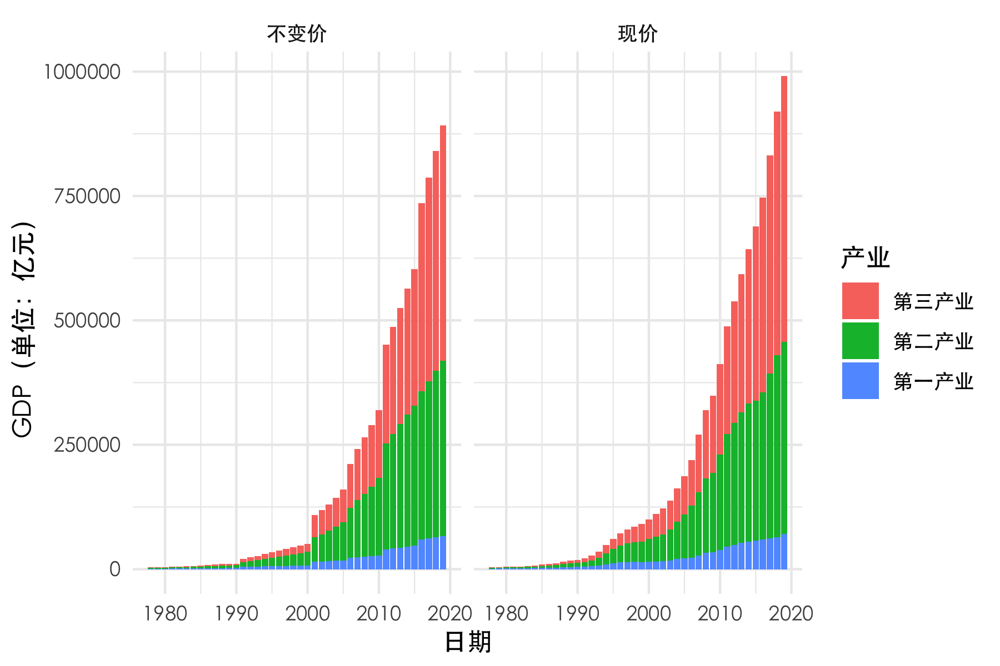
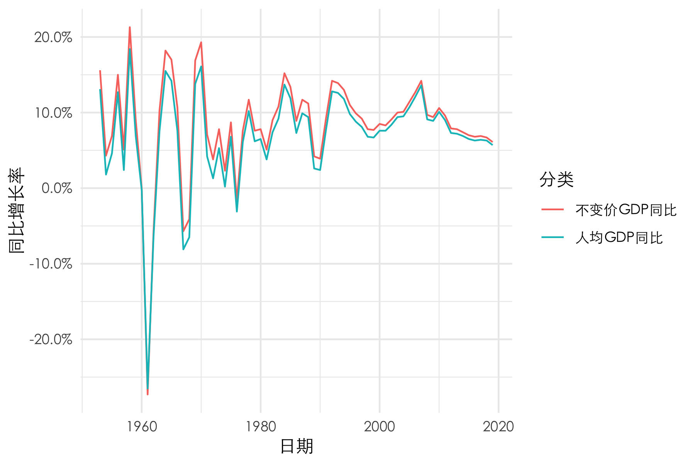
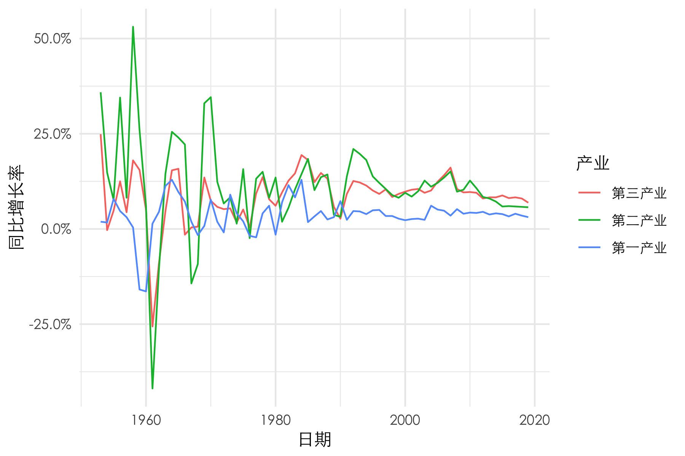
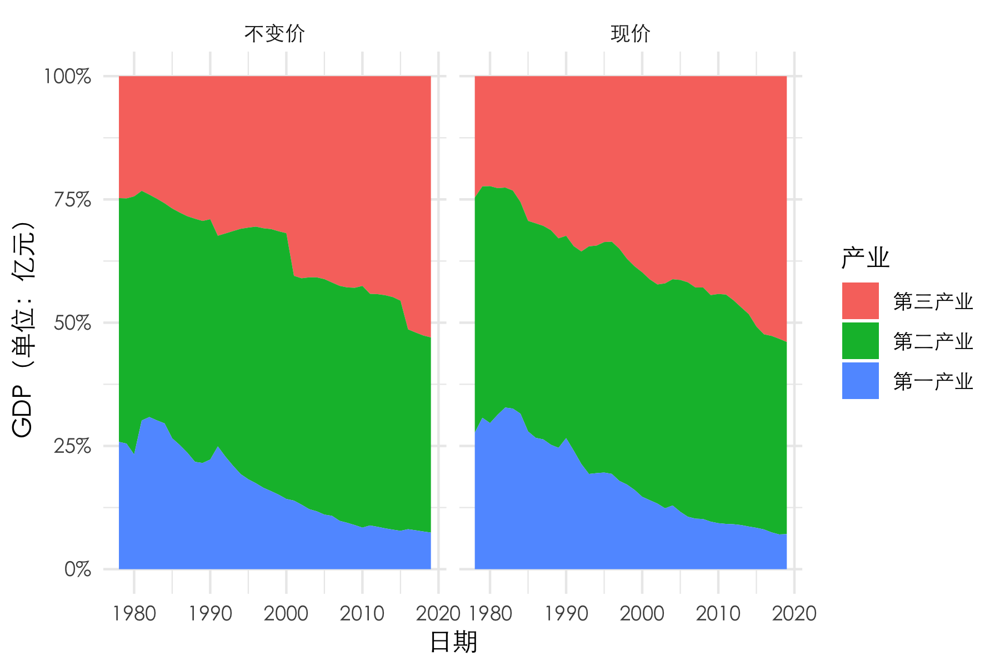
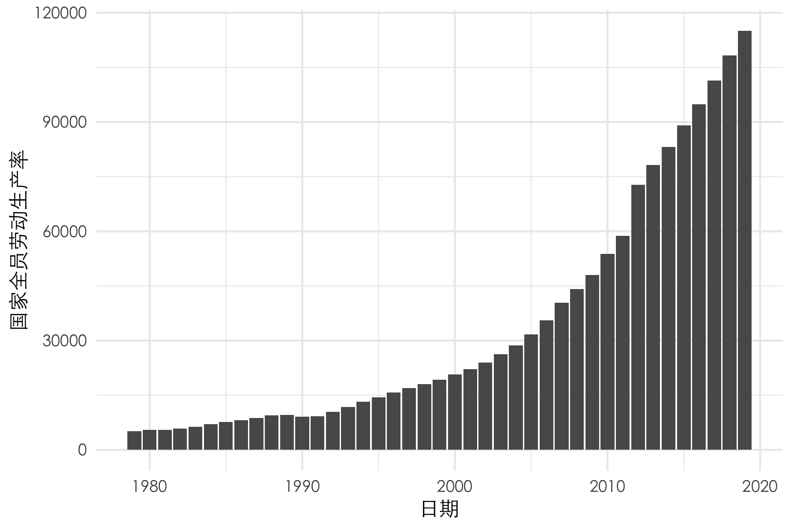
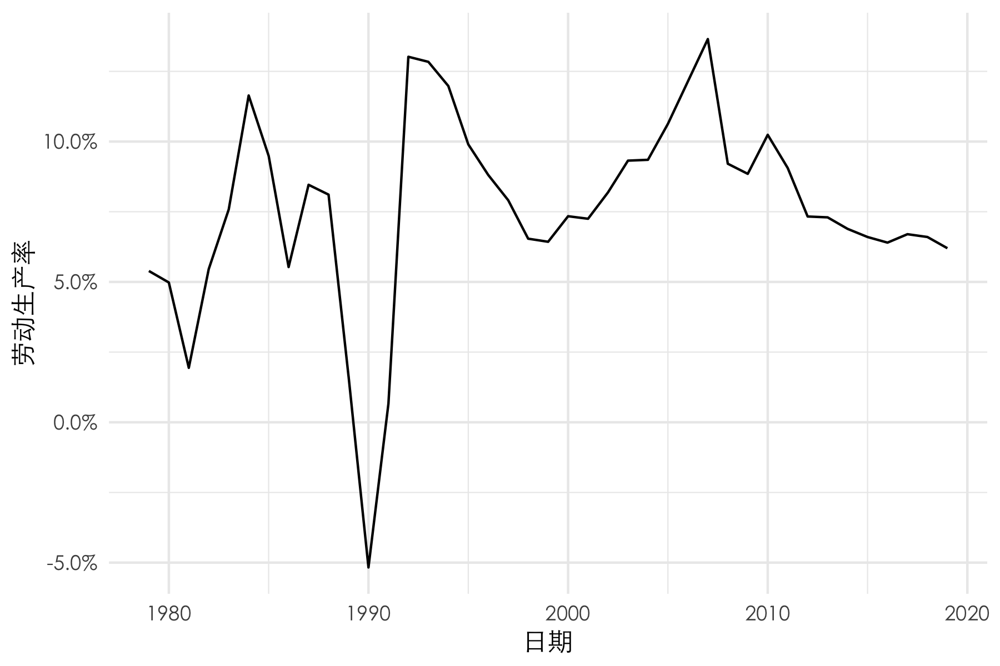
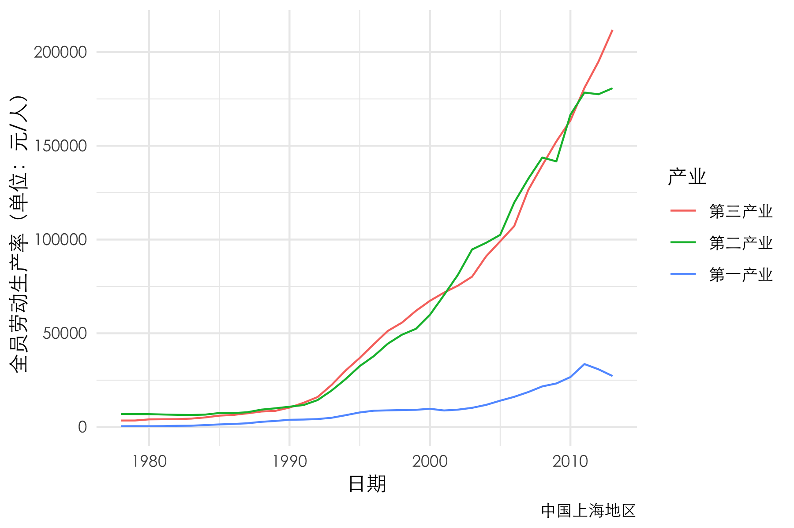
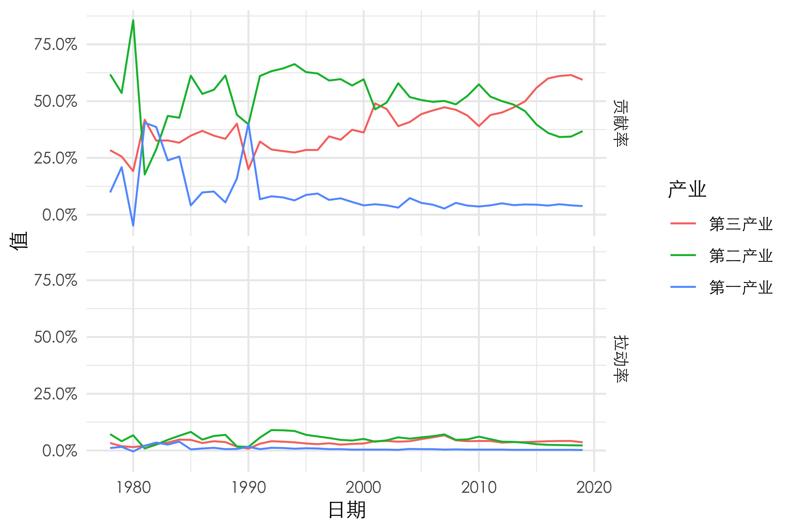
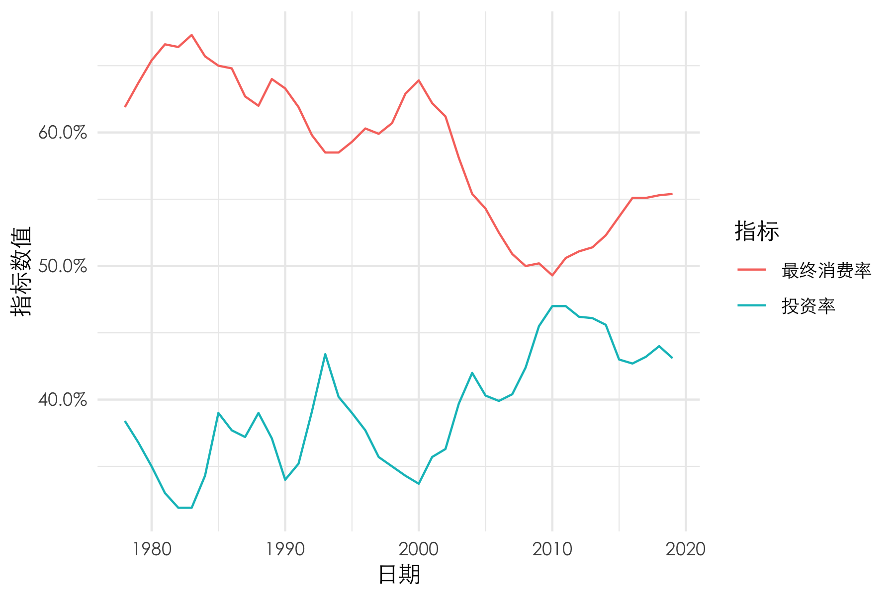

```{r setup, include=FALSE, message=FALSE}
knitr::opts_chunk$set(fig.pos = 'H', echo = FALSE, warning = FALSE, message = FALSE)
library(tidyverse)
library(knitr)
# base_family = 'STXihei'
```

\newpage

\tableofcontents

\newpage

# 背景

中国自 1978 年改革开放以来取得了非凡的成就，从新结构经济学的视角来看，中国改革开放以后经济的持续快速发展是发挥了后来者优势的潜力。尽管后来者优势
^[后来者优势即发展中国家能够将其他发达国家用过的成熟技术和产业转移到当地，实现技术创新、产业升级]
在工业革命以后就一直都存在，然而在 1978 年前我国的发展战略出了问题，在超英赶美的口号下，脱离了资本短缺的实际，造成了资源错配等问题。1978年我国的人均GDP只有155美元，还不到撒哈拉沙漠以南的非洲国家平均数的三分之一，84% 的人生活在国际上一天 1.25 美元的贫困线之下。1978 年底开始改革开放以后，国家从计划经济向市场经济国家转型，中国的经济也开始腾飞。

# 数据来源

该作业的数据来源于国家统计局[中国统计年鉴](http://www.stats.gov.cn/tjsj/ndsj/2019/indexch.htm)和各大统计数据网站。

# GDP 总量、增速和产业结构分析

```{r fig.cap="GDP总量变化趋势", out.width="80%", fig.align="center"}

```

可以看出，自 1978 年以来，中国的 GDP 的现价稳步上升，在考虑了通货膨胀率之后，上涨的幅度依旧很大，且增长非常稳定。

```{r fig.cap="不变价与人均GDP同比增长", out.width="80%", fig.align="center"}

```

对于不变价 GDP 的增速，在 1953 年到 1978 年间，GDP 的增长率虽然多数年份为正，但十分不稳定，某几年甚至出现增速为负的情况。这种情况在 78 年之后得到了好转，一直至今我国的 GDP 一直保持较为平稳地增长。值得注意的是，在 1999 年 - 2007，GDP 的增长率年年攀升，最高达到了 14.2%，然而在 08 年金融危机的影响下，增速开始连年放缓，19 年不变价GDP增长率只有 6.1%。人均 GDP 增长率趋势大致与不变价 GDP 相同。

```{r fig.cap="三大产业GDP同比增长率", out.width="80%", fig.align="center"}

```

GDP 增长率细分到三大产业则显示出了各自较为独特的特征。第二产业的增长率是三大产业中最不稳定的，第一产业和第三产业相对来说较为平稳。近 30 年，第一产业的增长率一直落后于第二三产业；近 5 年，第三产业增速一直高于第二产业。

```{r fig.cap="三大产业占GDP的比例", out.width="80%", fig.align="center"}

```

在 GDP 总量上升的同时，产业结构也在不断调整。可以看到，第二产业所占 GDP 的比例在近 50 年间并没有太多的变化，一直稳定在 40% - 50% 左右。然而，第三产业的占比则从 1978 年的 25% 左右一路上涨至 2019 年的超过 50% ，占比几乎翻倍；第一产业则恰恰相反。

第三产业的迅速发展，得益于许多新兴产业如网络服务业的兴起，导致的经营方式和管理方式的革命性变革，这些改变提高了企业管理的水平，带来了高效率和高效益，为社会生产和生活消费创造了全新的服务方式。第三产业的发展，提高了社会服务质量，经济效益同时得到了显著提高。

# 劳动生产率分析

```{r fig.cap="国家全员劳动生产率", out.width="80%", fig.align="center"}

```

```{r fig.cap="国家全员劳动生产率同比增幅", out.width="80%", fig.align="center"}

```

我国的全员劳动率一直保持稳定上升的趋势。从 1979 年的不到 1 万元/人一直上涨至 2019 年的 11 万元/人，除了 1981 年和 1990 年外，增幅一直为保持正值。经济发展代表收入水平不断提高，收入水平不断提高靠的是劳动生产率水平不断提高。劳动生产率水平不断提高的原因有二：一是现有的产业技术创新，二是附加价值更高的新产业不断地涌现。

```{r fig.cap="上海全员劳动生产率", out.width="80%", fig.align="center"}

```

如果将全国范围缩小至上海地区，那么可以看到，农业的劳动生产率已经远远落后于工业和服务业，工业和服务业则增长势头较为一致。然而在 2012 年之后，工业的增长开始放缓，农业甚至出现了负增长，而服务业则保持这非常高的增速，甚至还有所加快。这也体现出了上海作为中国的一个核心城市，其服务业的发达程度越来越高。

# 贡献率和拉动率分析

```{r fig.cap="三大产业的拉动率和贡献率", out.width="80%", fig.align="center"}

```

2019年第一、第二、第三产业对 GDP 的拉动率分别为：0.23、2.24、3.62 个百分点。从历史趋势我们可以看到，第一产业的贡献率一直非常低，第三产业的贡献率在 2007 年左右稳定超过了第二产业。

# 最终消费率和投资率分析

```{r fig.cap="最终消费率和投资率", out.width="80%", fig.align="center"}

```

毫无疑问，自78年以来，我国消费能力和水平稳步提升，然而从整个国民经济结构来看，消费增速低于投资和GDP增速，表现为消费率除了在少数几年间有短暂的上升外，总体呈下降态势。在 2000 年后消费率更是一度暴跌，从 62.3% 降到 2010 年的49.1%；与此形成鲜明对照的是投资率从2000年的 34.3% 飙升到 2010 年的 47.3%。
其次，从居民内部收入分配来看，收入分配政策总体上不利于低收入群体，不利于促进消费。

不过，需要提及的是，消费率的波动下降并非仅仅是中国的独有特征，而与国家的发展阶段有关。大多数国家的消费率都经历了长期下降的过程，而且也都会再进入逐步提升的阶段。可以看到，自 2010 年是我国的消费率拐点期，从这一年开始，我国的消费率开始稳步上升。

# 总结

从 1978 年到 2019 年，38年间我国平均每年国内生产总值的增长率达到 9% 左右。这对于世界上任何一个国家都是难以想象的。经过这些年的高速增长，国内生产总值增加了超过33倍。经济总量占世界经济的比重
^[按市场汇率计算]
从 1978 年的 2.3%，到如今已经超过了 16%。按市场汇率计算我国已经成为世界第二大经济体，如果按照购买力平价计算，则已经是世界第一大经济体，同时也是世界第一大贸易国。

改革开放40年带给了我们很多对我们未来发展有益的经验教训。我们之所以维持稳定和高速增长，最主要的原因是走适合中国自己的道路，而不盲目照搬外国的理论。经济要发展成功，就必须发挥比较优势，才能够形成竞争优势；同时要实事求是，在实践中不断创新。

与此同时，中国做为一个发展中国家的典范，给了其它国家很好的参考价值。随着中国的崛起，或许其它发展中国家也能从中国经验中学习，实现各自国富民强的梦想。


