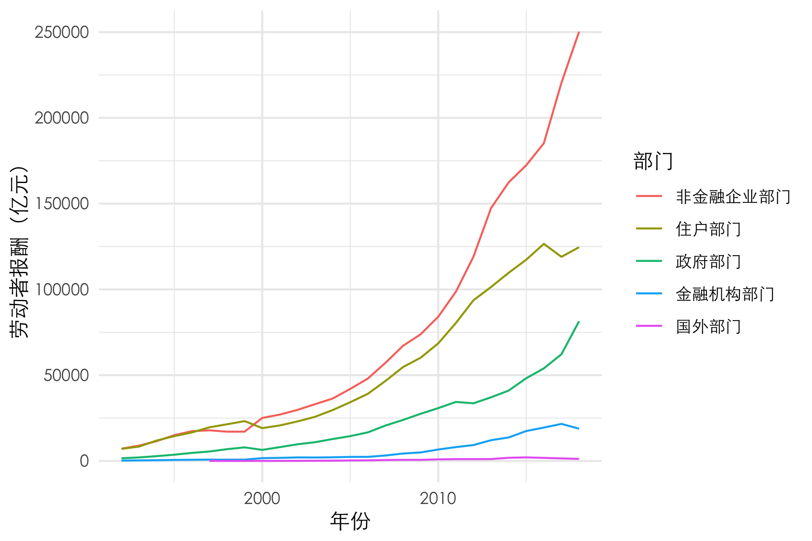
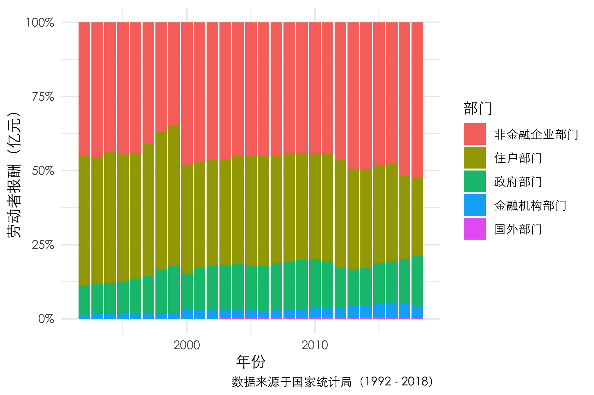
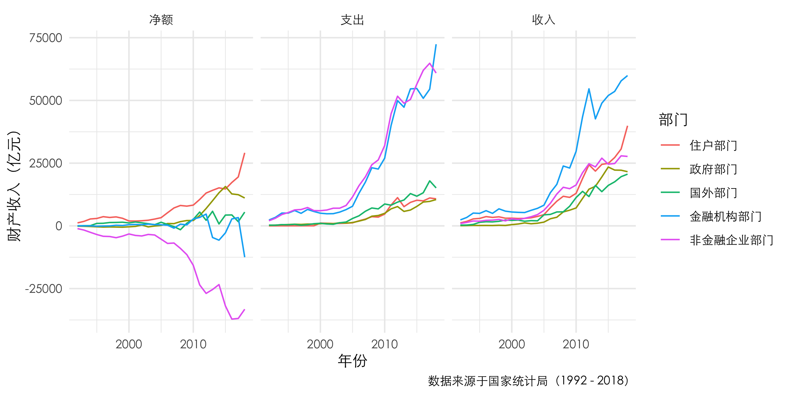
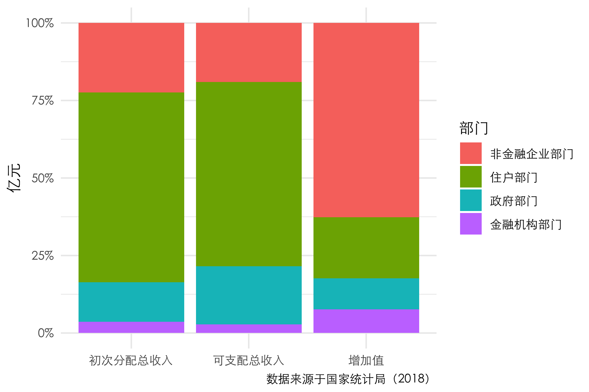
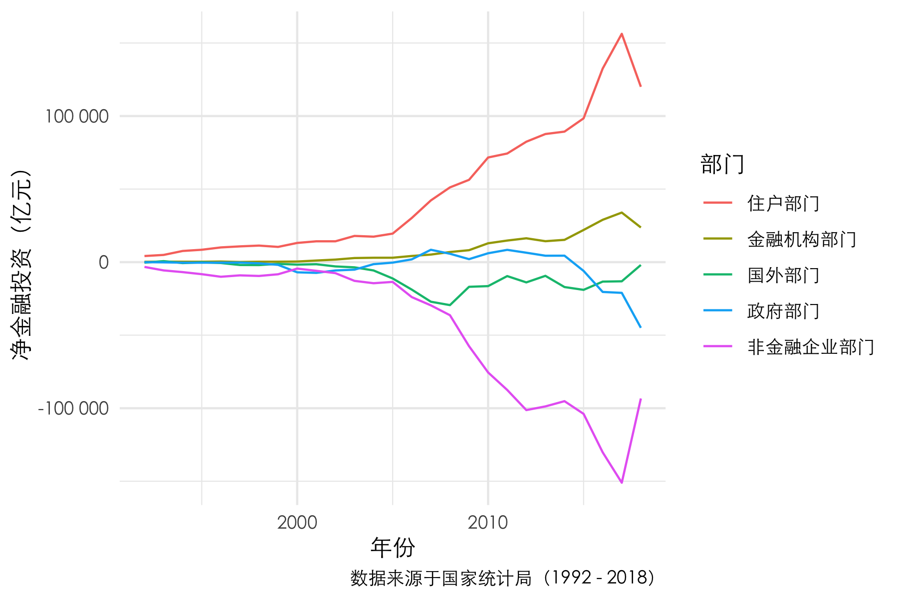

```{r setup, include=FALSE, message=FALSE}
knitr::opts_chunk$set(fig.pos = 'H', echo = FALSE, warning = FALSE, message = FALSE)
library(tidyverse)
library(knitr)
# base_family = 'STXihei'
```

\newpage

\tableofcontents

\newpage

```{r}
entity = read.csv("data/entity.csv")
entity = entity %>% 
  gather("years", "value", 2:ncol(entity)) %>% 
  separate(years, c("omit", "years"), sep = "X") %>% 
  select(-omit) %>% 
  separate(指标名称, c("table", "exchange", "direction", "items", "items_1", "items_2"), sep = ":") %>% 
  select(-table, -exchange) %>% 
  mutate(years = as.numeric(years))
```

# 引言

中国四大部门（非金融企业部门、金融机构部门、住户部门、政府部门）及国外部门之间的资金流动一直以来的都是经济发展的重要指标，而资金流量表涵盖着这方面的信息，在经济分析中具有十分重要的价值。 @book 我们通过分析资金流量表中各个主要部门的资金流动，从劳动者报酬、财产收入、初次分配和再分配、净金融投资四个方面来探寻其中部门间的经济规律，通过拉长时间维度，分析各部门的资金流动随时间的调整态势。

# 数据来源

数据来源于国家统计局（1992 - 2018）@website 


# 可视化分析

## 劳动者报酬

```{r eval=FALSE, include=FALSE}
entity %>%
  filter(items == "劳动者报酬", direction == "运用", is.na(items_2), ! items_1 %in% c("合计", "国内合计")) %>% 
  ggplot() +
  theme_minimal(base_family = "STXihei") +
  geom_line(aes(x = years, y = value, color = fct_reorder2(items_1, years, value))) +
  # scale_y_continuous(labels = scales::percent) +
  labs(x = "年份", color = "部门", y = "劳动者报酬（亿元）") +
  ggsave("plot/劳动者报酬折线图.png", height = 4, width = 6)
```

```{r fig.cap="中国各部门劳动者报酬时间变化折线图", out.width="80%", fig.align="center"}

```

自 92 年至 18 年，我国的劳动者报酬一直保持着很好的上升势头。然而近几年来，住户部门的劳动者报酬增长开始略显乏力，金融机构甚至发生了一定的下降。

```{r eval=FALSE, include=FALSE}
entity %>%
  filter(items == "劳动者报酬", direction == "运用", is.na(items_2), ! items_1 %in% c("合计", "国内合计")) %>% 
  ggplot() +
  theme_minimal(base_family = "STXihei") +
  geom_col(aes(x = years, y = value, fill = fct_reorder2(items_1, years, value)), position = "fill") +
  scale_y_continuous(labels = scales::percent) +
  labs(x = "年份", fill = "部门", y = "劳动者报酬（亿元）", caption = "数据来源于国家统计局（1992 - 2018）") +
  ggsave("plot/劳动者报酬比例图.png", height = 4, width = 6)
```

```{r fig.cap="中国各部门劳动者报酬时间变化占比图", out.width="80%", fig.align="center"}

```

从劳动者报酬支付的部门结构来看，2018年我国经济中约有一半的劳动者报酬来自非金融企业部门，表明非金融企业部门发放的报酬总额最大。住户部门和政府部门共支付了约 47% 的劳动者报酬，金融机构部门支付了剩下非常小的份额，主要原因是其吸纳就业人数较其它部门小得多。而政府部门支付的劳动者报酬十分可观，这一定程度上表明了中国政府的规模非常巨大。

值得注意的是，自 92 年至 18 年，住户部门支付的劳动者报酬的比例正在逐年减少，表明我国经济中“自给自足”的现象正在慢慢扭转，这于我国城镇化的飞速发展有着一定关系。

## 财产收入

```{r eval=FALSE, include=FALSE}
entity %>% 
  filter(items == "财产收入", is.na(items_2), ! items_1 %in% c("合计", "国内合计")) %>% 
  spread(direction, value) %>% 
  mutate(净额 = 来源 - 运用) %>% 
  rename(收入 = 来源, 支出 = 运用) %>% 
  gather("type", "value", 5:7) %>% 
  ggplot() +
  theme_minimal(base_family = "STXihei") +
  geom_line(aes(x = years, y = value, color = fct_reorder2(items_1, years, value))) +
  # scale_y_continuous(labels = scales::percent) +
  labs(x = "年份", color = "部门", y = "财产收入（亿元）", caption = "数据来源于国家统计局（1992 - 2018）") +
  facet_grid(cols = vars(type)) +
  ggsave("plot/财产收入.png", height = 4, width = 8)
```

```{r fig.cap="中国各部门财产收入时间变化折线图", out.width="99%", fig.align="center"}

```

从财产收入来看，金融机构部门的财产收入远高于其它部门，尽管再 08 年和 12 年受到金融危机的影响有小幅下跌，其体量仍然大幅超过了其它部门，在 2018 年达到了约 6 万亿元。住户部门则居于第二位，在 2018 年达到了约 4 万亿元，且在近几年来增长迅猛，主要原因是住户部门是主要的资金供应方，会获得大量的利息收入。政府部门的财产收入近几年连续下跌，与处在上升期的国外部门财产收入水平大致相当（2018年）。

从财产支出来看，金融机构部门和非金融企业部门有着大致水平相同的财产收入支出，在 2018 年约是其它部门的 3-4 倍。主要原因是非金融企业部门的规模最为巨大，而金融机构部门是金融中介，会发生大量的利息收支。

从两者抵消后的净额来看，非金融企业部门连年处于收不抵支的情况，主要原因是非金融企业部门需要支付资金所有者利息或红利。而政府部门和住户部门则一直保持收大于支。不过近几年政府部门的净额开始有所下降，而住户部门则一直保持增长。国外部门的财产收入净额较为稳定，一直保持略有结余，主要原因是中国支付给国外的红利大于从国外收到的红利。而于此形成对比的是金融机构部门则波动较大，在 2018 年净额为负 1.2 万亿。

## 初次分配和可支配收入

```{r eval=FALSE, include=FALSE}
entity %>% 
  filter(years == 2018, items %in% c("增加值", "初次分配总收入", "可支配总收入"), ! items_1 %in% c("合计", "国内合计")) %>% 
  ggplot() +
  theme_minimal(base_family = "STXihei") +
  geom_col(aes(x = items, y = value, fill = fct_reorder2(items_1, items, value)), position = "fill") +
  scale_y_continuous(labels = scales::percent) +
  labs(x = NULL, fill = "部门", y = "亿元", caption = "数据来源于国家统计局（2018）") +
  ggsave("plot/初次分配和可支配收入.png", height = 4, width = 6)
```

```{r fig.cap="2018年中国各部门初次分配和可支配收入占比图", out.width="80%", fig.align="center"}

```

2018 年非金融企业部门是增加值的主要创造者，比例达到国内生产总值的 67.5%，其次是住户部门，占比约为 15%，政府部门约为 13%。

经过了初次分配，与国民总收入的部门分布发生了较大的变化：

* 非金融企业部门占比明显下降，从 67.5% 急剧下降至不到 25%。原因是其支付了劳动者报酬、生产税净额和财产收入。
* 住户部门在得到了大量的劳动者报酬和财产收入后，占据了最大的份额，在 2018 年达到了约四分之三。
* 金融机构部门占比也有所下降。
* 政府部门由于得到了生产税净额，份额有所上升。

经过再分配后，各部门的可支配收入分布相比初次分配变化很小。其中，非金融企业部门和金融机构部门在支付了所得税后继续减小，政府部门继续增多。

收入分配总的来说使得全社会创造的价值从企业部门向住户部门和政府部门流动。

## 净金融投资

```{r eval=FALSE, include=FALSE}
entity %>% 
  filter(items == "净金融投资", ! items_1 %in% c("合计", "国内合计")) %>% 
  ggplot() +
  theme_minimal(base_family = "STXihei") +
  geom_line(aes(x = years, y = value, color = fct_reorder2(items_1, years, value))) +
  scale_y_continuous(labels = scales::number_format()) +
  labs(x = "年份", color = "部门", y = "净金融投资（亿元）", caption = "数据来源于国家统计局（1992 - 2018）") +
  ggsave("plot/净金融投资.png", height = 4, width = 6)
```

```{r fig.cap="中国各部门净金融投资时间变化折线图", out.width="80%", fig.align="center"}

```

从净金融投资来看，2018 年住户部门的是最主要的投资方，净额达到超过 10 万亿，金融机构部门次之，约为 3 万亿；非金融企业部门是最大的融资方，政府部门次之。我国对国外部门的投资比国外部门对我国的投资多。

不过近 10 年来，该逆差正在逐步减少，2018 年国内外投资已达到基本平衡的水平。近几年，住户部门的净金融投资正在削减，而非金融企业部门则融资减少，政府部门由净投资方成为了净融资方。

\newpage

# 结论

通过分析资金流量表中各个主要部门的资金流动，我们得出了以下核心结论：

* 我国的**劳动者报酬**一直以来保持着很好的上升势头，其中非金融企业部门最为迅猛，2018年我国经济中约有一半的劳动者报酬来自非金融企业部门。
* 近几年政府部门的**财产收入**净额开始有所下降，而住户部门则一直保持增长。国外部门的财产收入净额较为稳定，一直保持略有结余，金融机构部门则波动较大。
* 非金融企业部门是增加值的主要创造者，经过了**初次分配**，与国民总收入的部门分布发生了较大的变化，非金融企业部门、金融机构部门占比明显下降，住户部门、政府部门份额有所上升。**再分配**对部门的占比改变很小
* 住户部门的是最主要的投资方，非金融企业部门是最大的融资方。2018 年国内外金融投资已达到基本平衡的水平。近几年，住户部门的**净金融投资**正在削减，而非金融企业部门则融资减少，政府部门由净投资方成为了净融资方。

# 参考文献及数据库


